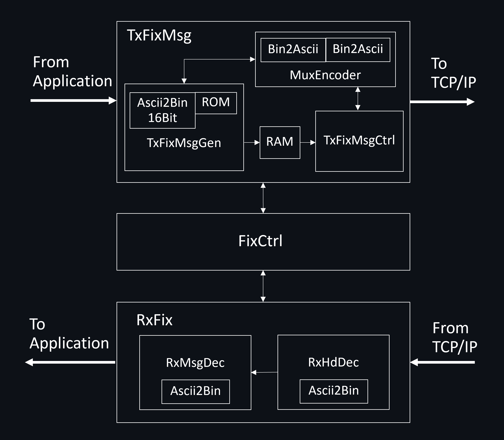
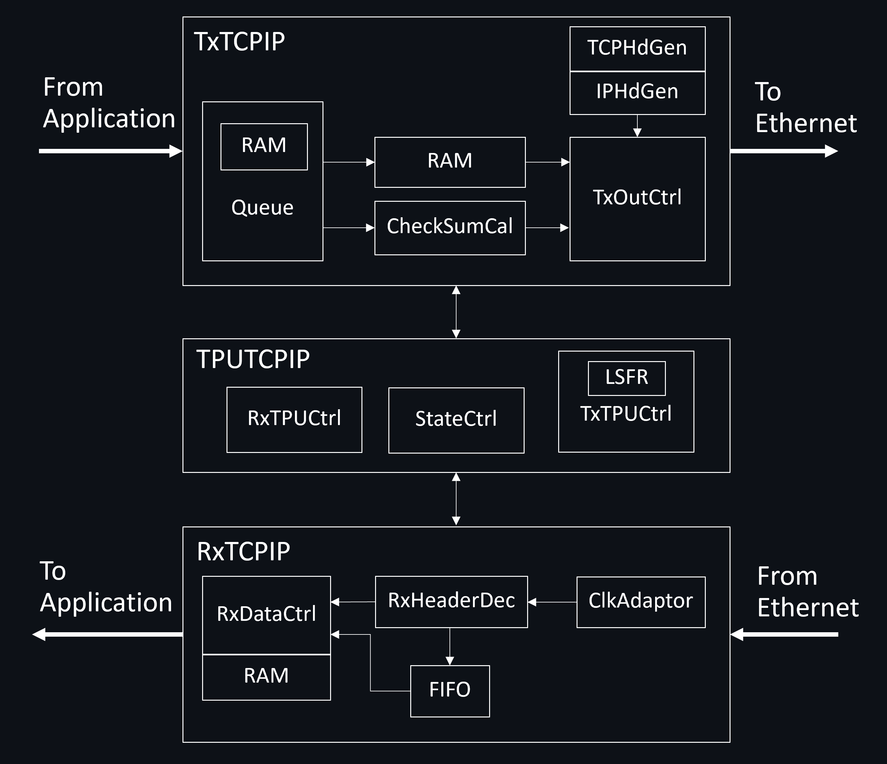
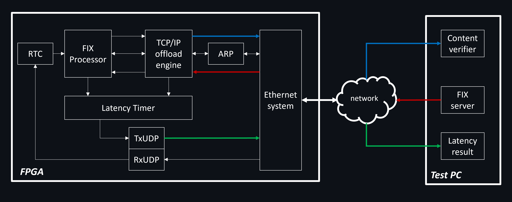

# Design and Implementation of a FIX and TCP/IP protocol offload engines for SET Market Data on FPGA

This project, undertaken as part of the final-year requirements for the electrical engineering program (EE2102499) at Chulalongkorn University in the academic year 2020, concentrates on digital hardware design, specifically FPGA, with a keen focus on optimising network protocols. Our efforts resulted in the development of a FIX processor for SET Market Data and a TCP/IP offload engine for 1Gbps Ethernet. If you are intrigued by our work and intend to explore further, our publication titled ['Design and Implementation of a FIX Protocol Offload Engine for SET Market Data'](https://ieeexplore.ieee.org/abstract/document/10127033) is available through the hyperlink.

### Contributors  
1. [Norawit Kietthanakorn](https://github.com/Noarwit-K) <br />
   Department of Electrical Engineering, Chulalongkorn University, Bangkok, Thailand <br />
   Email: Norawit.m@gmail.com

2. [Ratchanon Leung-on](https://github.com/PremRL) <br />
   Department of Electrical Engineering, Chulalongkorn University, Bangkok, Thailand <br />
   Email: ratchanonleung.on@gmail.com

3. [Boonchuay Supmonchai](https://ee.eng.chula.ac.th/boonchuay-supmonchai/) (Project advisor) <br />
   Department of Electrical Engineering, Chulalongkorn University, Bangkok, Thailand <br />
   Email: boonchuay.s@chula.ac.th

We would like to extend our gratitude to “Design Gateway (Thailand)” for generously providing the test environment and offering technical support throughout our project. More information about them can be found at the following link.
[DesignGateway Co., Ltd.](https://dgway.com/index_E.html)

___
### DISCLAIMER  
WE MAKE NO CLAIMS, PROMISES, OR GUARANTEES ABOUT THE ACCURACY, COMPLETENESS, OR ADEQUACY OF THE CONTENTS IN THIS PROJECT. WE EXPRESSLY DISCLAIM LIABILITY FOR ERRORS AND OMISSIONS IN THE CONTENTS OF THIS PROJECT. NO WARRANTY OF ANY KIND IS GIVEN WITH RESPECT TO THE CONTENTS IN THIS PROJECT AND OF THIS WEBSITE. ALL THE SOURCE CODE AND GUIDELINES PROVIDED IN THIS PROJECT ARE TO BE USED AT YOUR OWN RISK. <br /> <br />
YOU CAN USE THE CODES GIVEN IN THIS PROJECT FOR NON-COMMERCIAL PURPOSES WITHOUT OUR PERMISSION. BUT IF YOU ARE USING IT FOR COMMERCIAL PURPOSES, THEN CONTACT US WITH THE DETAILS OF YOUR PROJECT FOR OUR PERMISSION.
___

### Information about this project  
1. Participation in this project requires a foundational understanding of TCP/IP mechanisms, ARP protocol, FIX specifications (FIXT 1.1 and FIX 5.0SP2), and hardware design (FPGA).
2. While the TCP/IP protocol details are readily available on the internet, we regret to inform you that we cannot provide the FIX specifications and their test sets due to confidentiality reasons.
3. For simulation purposes, we used “ModelSim - INTEL FPGA STARTER EDITION 10.5b” with the additional requirement of the “altera_mf” library.
4. This project was successfully compiled by “Quartus Prime Lite Edition 17.1” and tested on MAX10 FPGA Development Kit.
5. The provided project includes only the hardware cores of our TCP/IP and FIX engines. The test system is not included as their peripherals, such as the Ethernet module, are intellectual properties of Design Gateway (Thailand).
6. The repository includes HDL codes for a FIX protocol processor and TCP/IP offload engine, along with Python codes for testing.
7. The throughput of every module in this design is one byte per clock cycle, designed for a clock frequency of 125 MHz.

#### HDL file structure
```
├───ip - IP cores used in an HDL project (e.g., RAM and FIFO)
├───package - HDL files containing packages, singals and components for simulation
├───sim - ModelSim scripts for compling sources and adding waveform
├───source - HDL files of the project and may contain subdirectories
└───testbench - Simulation HDL files for testing
```


## FIX processor

<br />



<br />

##### Features and limitations
- Supports FIXT 1.1 and FIX 5.0SP2 specifications.
- supports a limited number of message types.
- Supports basic FIX operations for connection and market data transmission.

Overall, the FIX processor is designed to connect to the TCP/IP offload engine on the right side and interface with the user application on the left side. As shown in the above illustration, the processor comprises several submodules and can be categorised into three groups. One of these groups is a transmit module, called "TxFixMsg", the second one is a FIX controller, namely "FixCtrl", and the last one is a receive module with the name of "RxFix".

Specifically, all FIX messages are communicated in ASCII strings and therefore, it is essential to be able to handle these string types. To manage resource usage efficiently, our design includes an ASCII-to-Binary decoder and a Binary-to-ASCII encoder for string-based messages, described as follows:

- Ascii2Bin - Converts an integer in the form of an ASCII string to binary, with a maximum binary size of 26 bits.
- Ascii2Bin16Bit - Similar to the above, but reduces the data width output to 16 bits for optimised resource usage.
- Bin2Ascii - Encodes a binary value to an ASCII string format.

The three components in this FIX processor are explained in details, starting with "TxFixMsg" and its submodules, followed by "RxFix" and its sub-elements, and finally concluding with FIXCtrl and its definition.

##### TxFixMsg
- MuxEncoder - Contains two Bin2Ascii encoders and can be shared and employed by both "TxFixMsgGen" and "TxFixMsgCtrl".
- TxFixMsgGen - Forms a FIX message requested by "TxFixMsgCtrl" with a certain number of supported message types and contains pre-assigned ROM for some constant fields in FIX messages.    
- RAM - Used as an intermediate buffer for storing a preparing FIX message before sending out by "TxFixMsgCtrl".
- TxFixMsgCtrl - Controls the other modules and data flow of the transmit function and interfaces with the main controller of this FIX design.

##### RxFix
- RxHdDec - Extracts necessary information from the FIX message received from the TCP/IP offload engine and verifies the validity of the packet such as a tag error and checksum.
- RxMsgDec - Processes the FIX message from the header processor to be decided in the main controller and forwards market data to the application layer.

##### FIXCtrl
- Includes a state controller for establishing and terminating the connection.
- Manages events from the FIX receive function to trigger a specific response.
- Tracks FIX sequence numbers for data reliability to make sure that it receives in-order FIX messages.
- Communicates with the TCP/IP offload engine for creating and terminating the connection.
- Utilises two blocks of memory for managing FIX rejection and retransmission.
- Handles other FIX processes such as Heartbeat, Market data request and Test request.

## TCP/IP offload engine

<br />



<br />

##### Features and limitations
- Supports IPv4 protocol.
- supports a maximum segment size of 8960 bytes.
- IP fragmentation is not supported.
- One Ethernet frame per TCP/IP packet.
- TCP options are not supported.
- Supports basic TCP/IP mechanisms for connection and data transmission.

As illustrated in the above image, our TCP/IP offload engine is designed with several modules. The left interface represents the application layer, specifically the FIX protocol processor, while the right interface connects to the Ethernet system.

Three main components, namely TxTCPIP, RxTCPIP and TPUTCPIP, comprise the engine. TxTCPIP and RxTCPIP are responsible for handling transmit and receive functions, respectively, while the last one is applied to deal with the main TCP/IP mechanism and controls the other two. The following provides the explanation of each sub-element in the application, presenting TxTCPIP, RxTCPIP, and TPUTCPIP in order.

##### TxTCPIP
- Queue - Manages data received from the upper layer in the transmit path, controlled by the TPU for reading data, searching contents and sending a TCP payload.
- CheckSumCal and RAM - Used for calculating a 16-bit checksum for the TCP/IP protocol, serving as an intermediate buffer to store the TCP payload during the calculation.
- TCPHdGen and IPHdGen - Contain a certain number of registers and have an RAM interface for writing a TCP/IP header necessary for the packet being sent.
- TxOutCtrl - Selects data from multiple sources, organises them into a TCP/IP format before transmitting to the Ethernet system.  

##### RxTCPIP
- ClkAdaptor - Contains an asynchronous FIFO to sync the data path, receiving from the Ethernet system, to a clock domain used in our system.    
- RxHeaderDec and FIFO - Designed for decoding TCP/IP packets, filtering garbage, handling TCP/IP sequence, and deciding on each received TCP/IP packet
- RxDataCtrl and RAM - Used to manage data sent to the application layer; in case of errors, they can cancel data being sent to the upper layer.

##### TPUTCPIP
- StateCtrl - The controller of the TCP/IP offload engine, mainly used for creating connections, terminating connections, organising network parameters and handling abnormal issues.
- LSFR - A random generator providing a random number for initializing the sequence of the TCP/IP protocol.
- TxTPUCtrl - Used to calculate and control data for transmission, handle TCP/IP flow control, and form a certain number of TCP/IP parameters placed in a transmitted packet.
- RxTPUCtrl - Includes a series of registers to deal with events driven by the receive function and also handles sequence numbers and acknowledgement numbers.

> [!NOTE]
> The design of an ARP protocol engine, provided in HDL in the same directory as the TCP/IP engine, is also included in this project because it is a basic infrastructure for network systems and the TCP/IP offload engine alone cannot be run without this module.

## Simulation Instructions

This project includes simulations for both the TCP/IP offload engine and the FIX processor. The TCP/IP offload engine simulation is provided at the system level, while the FIX processor can be explored at both the system level and individual submodule levels.

The method to run simulations is the same for all modules and relatively straightforward as explained below.   

1. Open the ModelSim tool and change the directory to '../sim'. In this directory, you will find two types of files:
  - 'run.do' - Used to compile and run the simulation.
  - 'wave.do' - Adds the waveform of the running HDL sources into the simulation.
2. In the ModelSim terminal (Transcript), enter 'do run.do' to run the simulation. Additionally, simulations for submodules of the FIX processor are provided and they can be run using commands like 'do run\<suffix\>.do', where \<suffix\> is the HDL source name.
3. After successfully running the simulation, the message '##### End Simulation #####' will be displayed on the terminal, and waveform can be viewed using the tool.

##### Example of running Ascii2Bin

<br />


- Open ModelSim and change the directory to '../hdl/FIX/sim'.
- Enter 'do runAscii2Bin.do' in the ModelSim's terminal.
- After the simulation ends, view and investigate the waveform.


## Testing Guidelines

<br />



This project was tested in the hardware system illustrated above. In addition to the main engines, several hardware modules, namely an RTC module, an ARP module and a Latency Timer, were coded in HDL in order to fulfill the system requirements. It is important to note that the Ethernet system and a UDP/IP offload engine are provided by Design Gateway.

The Ethernet system is used to handle the low-layer protocols, which are data link and physical layers. Next to that, the ARP module is included in order to acquire the MAC address required in the TCP/IP protocol. While the RTC timer is applied to provide the current data and time to the FIX processor, the latency timer is used to measure the time that both FIX and TCP/IP engines are used to process the packet. Lastly, the UDP/IP engine is used to initialise the date and time in the RTC module and also to send the latency result back to the test PC.

While we cannot provide all Python codes for system testing due to confidentiality issues, some codes are included in this repository. We encourage you to use these codes as a starting point and build upon them to develop a comprehensive testing system.

## Suggestion

While this development is designed to meet low-latency requirements, we propose that even lower latency times could be achieved with a more suitable test system. For example, in a 10Gbps environment, latency numbers have the potential to be reduced by a factor of 10. Therefore, we highly recommend that individuals interested in researching this field acquire an appropriate test environment.

It is worth noting that although the FIX protocols have become obsolete for the SET stock exchange, which introduced the Nasdaq-based ITCH and OUCH protocols, we believe that this prototype can still be beneficial for researching in network optimisation using FPGAs, hardware design, and further development of time-sensitive requirements in the financial sector.

Thank you for your participation in this project, and we hope that you can put our work to good use.
